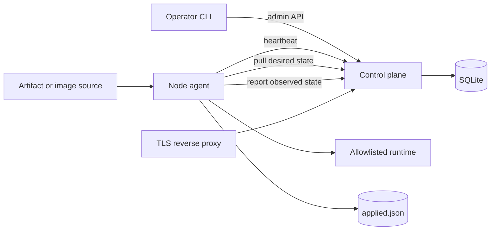
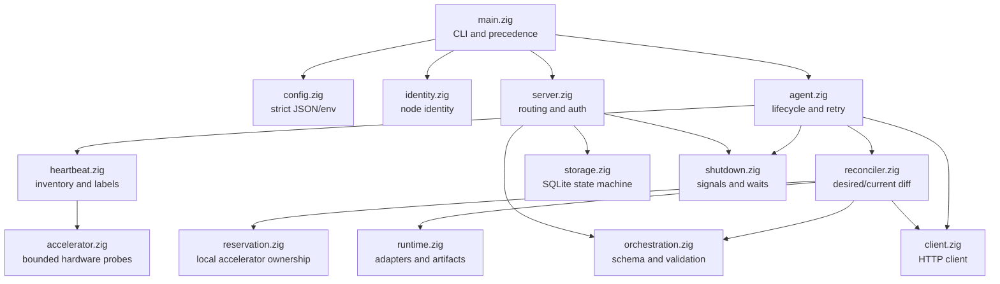
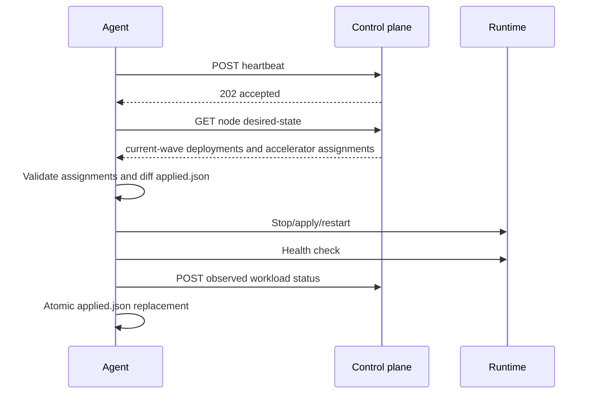

# Nimbus Architecture

## Purpose

Nimbus is a pull-based fleet and workload orchestrator for heterogeneous edge
AI devices, intermediary computers, lightweight servers, and cloud nodes. A
single native Zig executable contains the agent, control plane, operator CLI,
and inspection commands.

The design optimizes for small deployment footprint, agent-initiated networking,
explicit runtime permissions, and understandable failure behavior. It is aimed
at appliance and edge fleets whose workload model is smaller than Kubernetes,
not at Kubernetes API or ecosystem compatibility.

For commands and setup, see the [project README](../README.md). For deployment
schema and runtime behavior, see [Workload orchestration](orchestration.md).
Contributor guidance is in [Development](development.md).

## Implemented scope

Nimbus currently provides:

- stable node identity, roles, and labels;
- periodic heartbeat, platform inventory, and online/stale state;
- bounded NVIDIA and Jetson accelerator inventory with opaque device IDs;
- declarative accelerator requirements and exclusive logical reservations;
- desired-state storage and agent-side reconciliation;
- process, systemd, Docker, and containerd/nerdctl adapters behind an allowlist;
- runtime, HTTP, TCP, and direct-command health checks;
- deterministic batched rollout, health gates, pause, and rollback;
- SHA-256 artifact verification and optional Ed25519 enforcement;
- SQLite-backed specifications, assignments, current state, history, and audit;
- concurrent HTTP connections with serialized database transactions;
- separate node/operator bearer tokens when configured;
- static Linux and native Windows/macOS cross-builds.

Pool-wide resource scheduling, service discovery, overlay networking,
distributed storage, secrets delivery, runtime accelerator injection,
high-availability control planes, and per-node cryptographic identity are
outside the current implementation.

## Why Zig

Zig supports the operational shape of Nimbus:

- one build graph cross-compiles five native artifacts;
- small processes start without a garbage-collected language runtime;
- allocators and I/O handles have visible ownership and cleanup;
- SQLite is embedded directly through C interoperability;
- compile-time target metadata supplies platform fields;
- musl produces self-contained static Linux binaries.

Nimbus pins Zig 0.16.0. Its evolving standard library and explicit resource
management are real maintenance costs, so platform-sensitive operations are
kept in focused modules.

## System context



The control plane never opens a connection to a managed node. Agents work
behind NAT as long as they can reach the API and required artifact/image
sources. Agents and the CLI support HTTPS. The embedded server listener remains
HTTP-only, so a reverse proxy supplies the production TLS boundary.

## One executable, explicit roles

```text
nimbus agent inspect
nimbus agent run
nimbus server
nimbus nodes list
nimbus nodes inspect NODE_ID
nimbus deployments apply FILE
nimbus deployments list
nimbus deployments inspect NAME
nimbus deployments delete NAME
nimbus deployments rollback NAME
```

Keeping roles together simplifies cross-platform packaging. The source modules
preserve boundaries so agent and server binaries can be split later without
changing protocol types.

## Component model



| Module | Responsibility |
|---|---|
| `main.zig` | Command dispatch, CLI validation, and configuration precedence |
| `config.zig` | Strict configuration parsing and environment conversion |
| `identity.zig` | Node-ID validation and atomic identity creation |
| `heartbeat.zig` | Versioned node report, role, labels, and target metadata |
| `accelerator.zig` | Generic accelerator types, bounded providers, and claim validation |
| `agent.zig` | Heartbeat/reconcile loop, jitter, retry, and one-shot behavior |
| `orchestration.zig` | Desired-state types and trust-boundary validation |
| `reconciler.zig` | Local diff, apply/stop/restart, health, restore, and status |
| `reservation.zig` | Canonical, fail-closed local accelerator reservation ledger |
| `runtime.zig` | Runtime adapters, artifact streaming, digest/signature checks |
| `client.zig` | Authenticated JSON HTTP requests |
| `server.zig` | Concurrent connection handling, routing, auth, and body limits |
| `storage.zig` | Transactions, rollout state machine, persistence, and queries |
| `shutdown.zig` | Signal state and interruptible sleep |

## Configuration and identity

Configuration precedence is consistent across commands:

```text
CLI > environment > JSON configuration file > built-in default
```

JSON rejects unknown fields. Strings are copied into process-lifetime storage
before the input buffer is released. Agent labels are validated and duplicate
keys are rejected.

Without `--id`, the agent atomically creates and reuses a random node ID in the
identity file. Node and deployment identifiers are limited to 128 safe ASCII
characters so they can cross URL, JSON, database, and local-state boundaries
without interpretation.

## Protocol loops

### Discovery and liveness

The agent sends a schema-versioned heartbeat containing node ID, hostname,
role, labels, compiled OS/architecture/ABI, CPU count, accelerator inventory,
features, version, and timestamp. Heartbeat v2 introduced the distinction
between a trustworthy empty `complete` inventory and `partial` or `unavailable`
probe results. NVIDIA UUIDs are converted to node-scoped opaque hashes; Jetson
GPU and DLA identities use stable functional slots.

The server accepts heartbeat versions 1, 2, and 3 during rolling upgrades.
Version 1 has no accelerator inventory, version 2 requires a bounded and
internally consistent inventory, and version 3 also carries negotiated feature
names. Current agents emit v3 with `accelerator-requirements-v1`. Servers must
be upgraded before agents because older servers reject newer heartbeat schemas.
The server stores both agent time and server receipt time. Online/stale state is
derived from receipt time, avoiding trust in device clock accuracy.

### Reconciliation



Orchestration runs after a successful heartbeat, so loss of control-plane
connectivity does not immediately stop a running workload. Once connectivity
returns, the next pass converges local state.

The runtime allowlist is agent policy, not desired state. A control-plane
deployment cannot enable an adapter disabled on a node. Commands are argv
arrays and never pass through a shell.

For an accelerator requirement, the control plane selects compatible IDs in a
stable order and stores an exclusive logical reservation. The agent validates
the assignment against the inventory snapshot sent in the preceding heartbeat
and atomically persists a canonical local ledger. Until runtime device injection
is implemented in A3, it reports `accelerator_assignment_unavailable` when no
compatible reservation is ready or `runtime_device_injection_unavailable` when
one is ready, without starting or replacing the workload.

## Desired-state and rollout model

The control plane retains the current and previous canonical deployment JSON.
Revision numbers must increase. Applying a revision rebuilds deterministic wave
assignments for all currently matching nodes in node-ID order.

Only assignments at or below `current_wave` receive the current specification.
Later waves retain the previous specification, if any. The server advances
after all current-wave nodes report the current revision healthy/stopped and
the post-health pause expires. Failure/degradation at the unavailable threshold
marks the rollout failed or restores the previous specification.

Agent-side restore and control-plane rollback are separate defenses:

- if applying a new local revision fails, that agent tries to restore its old
  local specification before reporting failure;
- if the wave failure threshold is reached, the control plane changes desired
  state back to the previous revision for every assignment.

## Runtime ownership

The local applied-state file records deployment name, revision, adapter,
reference, PID metadata, and canonical specification. It is replaced
atomically only after the pass finishes.

Linux process records include `/proc` start-time ticks. Nimbus checks the ticks
before health or termination, preventing PID reuse from targeting an unrelated
process. systemd owns host-process supervision; Docker and nerdctl own container
restart behavior. Nimbus owns desired/current comparison and rollout reporting.

Artifacts are streamed to `.part`, capped during transfer, verified by SHA-256,
optionally verified with Ed25519, marked executable, and atomically renamed.
Container images must be pinned by digest.

## HTTP surface and authentication

| Method | Path | Credential | Purpose |
|---|---|---|---|
| `GET` | `/healthz` | public | Process health |
| `GET` | `/readyz` | public | SQLite readiness |
| `POST` | `/v1/heartbeat` | node | Register/update a node |
| `GET` | `/v1/nodes/{id}/desired-state` | node | Pull node desired state |
| `POST` | `/v1/nodes/{id}/workload-status` | node | Report observed state |
| `GET` | `/v1/nodes?limit=N&after=ID` | admin | Cursor-paginated fleet state |
| `GET` | `/v1/nodes/{id}` | admin | Inspect one node |
| `GET` | `/v1/deployments` | admin | List deployments |
| `PUT` | `/v1/deployments/{name}` | admin | Apply increasing revision |
| `GET` | `/v1/deployments/{name}` | admin | Inspect rollout/assignments |
| `DELETE` | `/v1/deployments/{name}` | admin | Remove desired workload |
| `POST` | `/v1/deployments/{name}/rollback` | admin | Restore previous revision |

The administrative token falls back to the node token only when no separate
admin token is configured. Payloads have endpoint-specific limits and all
protocol structs are strictly validated before mutation. Unauthenticated
servers fail to start on non-loopback binds unless an explicit insecure override
is supplied.

## Persistence and concurrency

SQLite opens in WAL mode with foreign keys, full mutex support, and a five
second busy timeout. The schema includes:

| Table group | Tables |
|---|---|
| Node state | `nodes`, `node_labels`, `heartbeat_history`, `node_features`, `node_accelerator_inventory`, `node_accelerators`, `node_accelerator_capabilities` |
| Desired state | `deployments`, `deployment_targets`, `deployment_label_targets` |
| Observed state | `workload_assignments`, `workload_status_history`, `accelerator_reservations`, `placement_decisions` |
| Operations | `audit_events`, `schema_migrations` |

Heartbeat, deployment apply, desired-state assignment, status transition, and
rollback mutations use explicit transactions. The server accepts connections
concurrently through `std.Io.Group`, bounded to 64 active handlers with a
15-second request deadline. An I/O-aware registry mutex serializes use of the
shared SQLite connection and protects multi-statement transactions. Current node
state is updated on every heartbeat; history is sampled every five minutes and
retained for seven days. Audit events and workload status history are retained
for 30 days. The canonical heartbeat JSON remains available for exact node
inspection, while A2 also normalizes feature and accelerator claims for
selection. Current device rows are replaced by each heartbeat, but logical
reservations remain independent so a partial probe or disappearance does not
silently transfer ownership to another workload.

This architecture handles overlapping edge requests without claiming
horizontal control-plane scale. One server process and one database remain the
consistency boundary.

## Build and deployment

`build.zig` compiles the Zig modules and vendored SQLite amalgamation for Linux
x86_64/ARM64 musl, Windows x86_64, and macOS x86_64/ARM64. Linux artifacts are
stripped and statically linked. The scratch container runs the server; a
hardened systemd unit runs the agent.

`justfile` is the canonical interface for formatting, tests, local demos,
cross-builds, static verification, checksums, containers, and Git checks. CI
uses the same recipes and ignores documentation-only changes.

## Security boundary

Implemented controls include strict schemas, prepared SQL, bounded requests,
runtime allowlists, direct argv execution, immutable image references, artifact
digests, optional signature enforcement, atomic state/artifact replacement, PID
identity checks, and node/admin token separation.

Remaining security work includes TLS termination in the server, per-node credentials,
credential rotation, mTLS, authorization scopes, signed desired-state
documents, attestation, secret delivery, and sandbox/resource policy. The
shared node token allows node impersonation by another token holder.

## Known limitations

- One SQLite control plane; no replication, leader election, or failover.
- No rollout deadline or automatic skip for an offline current-wave node.
- No pool-wide or dynamic resource placement; A2 allocates only within explicit
  node, role, and label targets.
- Accelerator requirements exist, but runtime device/CDI injection is not yet
  implemented. Accelerator deployments are blocked before execution.
- No ports, mounts, network, secret, or general resource-limit schema.
- No offline deadline/lease that stops workloads after prolonged disconnection.
- Process runtime is Linux-only and intentionally smaller than systemd.
- HTTP-only embedded server, process artifact downloads, and runtime health URLs.
- Windows/macOS artifacts compile, but orchestration adapters depend on host
  tools and the direct process adapter is Linux-only.
- Safety-critical edge deployments still require independent hardware and
  device watchdogs.
