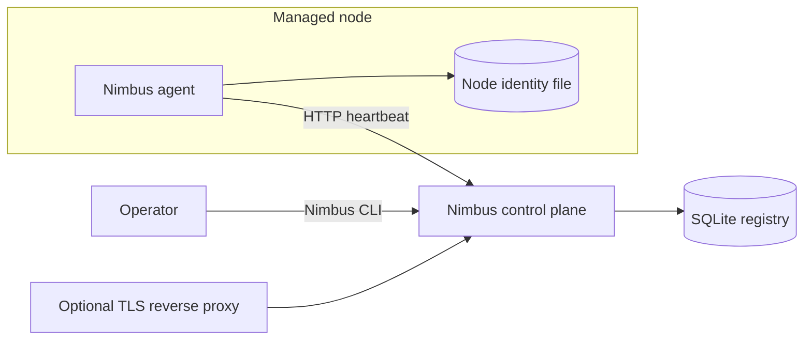
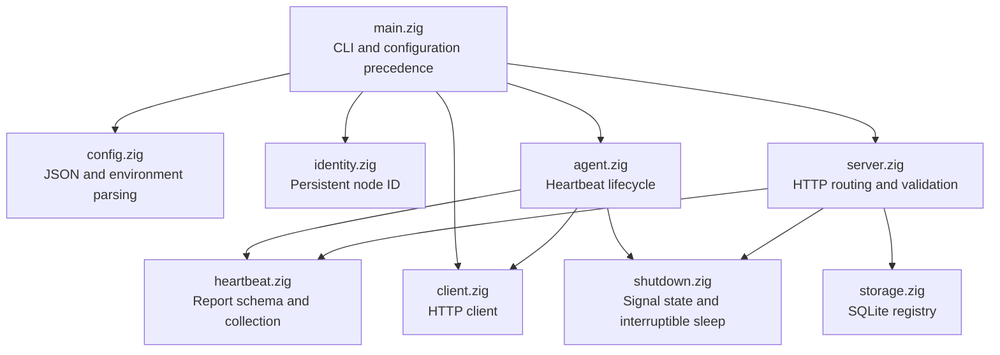
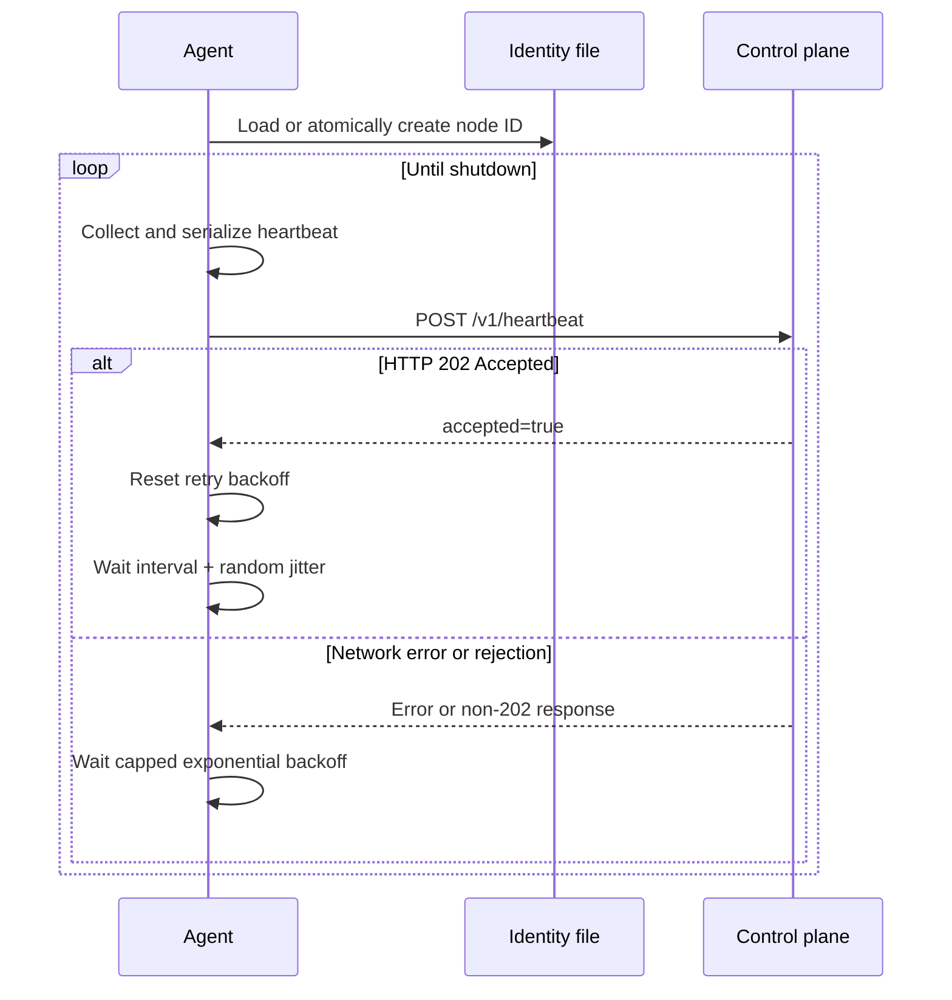
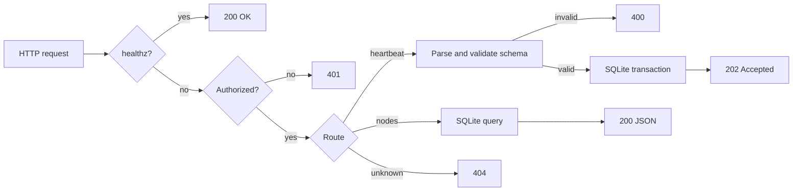

# Nimbus Architecture

## Purpose

Nimbus is a small fleet discovery and health foundation for heterogeneous edge,
server, desktop, and cloud nodes. It provides a portable agent, a minimal
control plane, and an operator CLI in one native executable.

This document explains the implemented architecture. It focuses on component
boundaries, data ownership, runtime behavior, and design trade-offs. For
commands and installation, see the [project README](../README.md). For code
contribution guidance, see [Development](development.md).

## Current scope

Nimbus currently supports:

- stable node identity stored on the managed node;
- periodic, agent-initiated heartbeat delivery;
- OS, architecture, ABI, CPU-count, role, hostname, and agent-version reports;
- interval, jitter, exponential retry, and POSIX graceful shutdown;
- optional bearer-token authentication;
- persistent current node state, heartbeat history, and audit events in SQLite;
- online and stale node views;
- Linux x86_64 and ARM64, Windows x86_64, and macOS x86_64 and ARM64 builds.

Nimbus does not currently implement GPU discovery, workload deployment,
desired-state reconciliation, remote commands, or self-update. The server is
also not a general observability platform or scheduler.

## Why Zig

Zig is used here as an operational systems language rather than as an end in
itself. Several properties directly support the project:

- **Cross-compilation:** one build graph produces all five release targets.
- **Small native processes:** the agent has no garbage collector or language
  runtime service to initialize on each node.
- **Explicit resource ownership:** allocators, files, sockets, and database
  handles have visible lifetimes and cleanup paths.
- **C interoperability:** SQLite is embedded from its C amalgamation through
  `@cImport` and compiled as part of the Zig build.
- **Compile-time target metadata:** heartbeat platform fields come from the
  selected target rather than a handwritten platform table.
- **Static Linux releases:** musl targets produce self-contained Linux
  executables suitable for small images and heterogeneous hosts.

These benefits have costs. Zig and its standard library evolve quickly, C
compilation makes clean builds slower, and explicit memory/error handling
requires care. Nimbus pins Zig 0.16.0 and keeps platform-sensitive code behind
small modules to control that risk.

## System context



Communication is agent-initiated. The control plane does not open inbound
connections to managed nodes. This allows agents to operate behind NAT and
firewalls, although the current implementation does not yet poll for desired
state.

## One executable, multiple roles

The build produces one `nimbus` executable. `src/main.zig` selects a role from
the command hierarchy:

```text
nimbus agent inspect
nimbus agent run
nimbus server
nimbus nodes list
nimbus nodes inspect NODE_ID
```

Keeping the roles together reduces packaging complexity during the foundation
phase. The modules already separate agent, server, client, and storage logic so
future binaries can be split without redesigning the protocol.

## Component model



### Module responsibilities

| Module | Responsibility |
|---|---|
| `main.zig` | CLI dispatch, configuration precedence, node commands, and process entry point |
| `config.zig` | Strict JSON configuration parsing and numeric environment overrides |
| `identity.zig` | Node-ID validation and atomic identity-file creation |
| `heartbeat.zig` | Versioned report types, target metadata, CPU count, timestamp, and JSON serialization |
| `agent.zig` | Heartbeat loop, jitter, capped exponential backoff, and one-shot mode |
| `client.zig` | Authenticated heartbeat POST and JSON GET requests |
| `server.zig` | Listener lifecycle, bearer authentication, request validation, and API routing |
| `storage.zig` | SQLite initialization, transactions, prepared statements, queries, and status calculation |
| `shutdown.zig` | Process-wide shutdown flag, POSIX signal handlers, and interruptible waits |

## Configuration flow

Operational configuration follows one precedence rule:

```text
command-line option
        ↓ overrides
environment variable
        ↓ overrides
JSON configuration file
        ↓ overrides
built-in default
```

The configuration file is loaded into the process arena. JSON strings are
always copied because the input file buffer is released immediately after
parsing. Unknown JSON fields fail validation instead of being silently ignored.

The default identity path is `.nimbus-node-id`. If no explicit ID is provided,
the agent creates a `node-` ID from 16 random bytes, writes it through an atomic
file operation, syncs it, and reuses it on later starts. Valid IDs contain only
ASCII letters, digits, `-`, `_`, and `.` and are limited to 128 bytes.

## Heartbeat model

The current schema is version 1:

```json
{
  "schema_version": 1,
  "node_id": "node-0123456789abcdef0123456789abcdef",
  "hostname": "edge-01",
  "role": "edge",
  "platform": {
    "os": "linux",
    "arch": "aarch64",
    "abi": "musl"
  },
  "resources": {
    "cpu_count": 8
  },
  "timestamp_unix_ms": 1784383141567,
  "agent_version": "0.2.0"
}
```

`platform` describes the compiled target. `timestamp_unix_ms` is the agent's
reported wall-clock time. The server separately records its receipt time and
uses the receipt time for liveness decisions.

## Agent lifecycle



The first retry delay defaults to one second and doubles up to the configured
maximum. A successful heartbeat resets it. Jitter is uniformly chosen from
zero through the configured maximum and is added after a successful send.
`--once` returns after the first success and treats a rejection as an error.

On POSIX systems, SIGINT and SIGTERM set an atomic shutdown flag. Agent waits
are split into short intervals so shutdown is observed promptly.

## Control-plane request flow

The server exposes a small HTTP surface:

| Method | Path | Authentication | Behavior |
|---|---|---|---|
| `GET` | `/healthz` | Public | Process health response |
| `POST` | `/v1/heartbeat` | Bearer token when configured | Validate and persist one heartbeat |
| `GET` | `/v1/nodes` | Bearer token when configured | Return current fleet summaries |
| `GET` | `/v1/nodes/{node_id}` | Bearer token when configured | Return current report and liveness status |



Heartbeat bodies are limited to 64 KiB. The server requires schema version 1
and validates node ID, hostname, role, platform strings, agent version, and a
positive timestamp before storage.

The HTTP server currently handles one accepted connection at a time. This is a
deliberate simplicity trade-off, not a target scalability model.

## Persistence model

SQLite is embedded directly in the executable. On open, Nimbus enables WAL
mode, foreign keys, and a five-second busy timeout, then creates three tables:

| Table | Purpose |
|---|---|
| `nodes` | One current row per node, including the latest full report JSON |
| `heartbeat_history` | Append-only accepted heartbeat records with reported and received timestamps |
| `audit_events` | Basic accepted-heartbeat audit records |

Each accepted heartbeat executes one transaction:

1. Begin an immediate transaction.
2. Insert or update the current `nodes` row.
3. Append the raw report to `heartbeat_history`.
4. Append a `heartbeat.accepted` audit event.
5. Commit, or roll back on any error.

Current-state columns support list queries without reparsing JSON. The raw JSON
is retained to preserve the exact accepted report and to support node
inspection.

## Liveness semantics

Nimbus currently has two displayed states:

- `online`: `now - last_received <= stale_after`
- `stale`: `now - last_received > stale_after`

The default threshold is 90 seconds. Liveness is computed at query time from
the control plane's receipt timestamp, so an incorrect agent clock does not
make a node appear fresh or stale. There is no separate background state
transition or offline event yet.

## Security boundary

The current security model is intentionally narrow:

- `/healthz` is public; other endpoints can require one bearer token.
- Heartbeats are validated before storage.
- Node IDs are restricted before being used in queries or paths.
- SQL values use prepared statements.
- The agent does not expose arbitrary shell execution.
- The control plane never initiates a connection to an agent.

TLS is disabled in the current binary to keep the bootstrap transport and
cross-build small. Non-local deployments must place a TLS-terminating reverse
proxy in front of the server. The bearer token is development-grade shared
authentication; per-node identities, rotation, mTLS, and authorization roles
are not implemented.

## Build and deployment architecture

`build.zig` compiles the Zig sources and the vendored SQLite C amalgamation.
The release graph emits:

| Artifact directory | Zig target |
|---|---|
| `linux-x86_64` | x86_64 Linux musl |
| `linux-aarch64` | AArch64 Linux musl |
| `windows-x86_64` | x86_64 Windows GNU ABI |
| `macos-x86_64` | x86_64 macOS |
| `macos-aarch64` | AArch64 macOS |

Linux releases are stripped and statically linked. The scratch Docker image
contains the Linux binary and an empty writable `/data` directory. A hardened
systemd unit is provided for the agent.

`justfile` is the operational front end for local development and CI. GitHub
Actions invokes the same `just ci` pipeline used locally.

## Known limitations

- HTTP only; TLS must terminate externally.
- One shared bearer token rather than per-node credentials.
- Sequential request handling in the control plane.
- No heartbeat-history retention or compaction policy.
- No versioned database migration framework beyond idempotent table creation.
- CPU count is the only resource probe.
- No labels, accelerator discovery, desired state, runtime adapter, or OTA path.
- POSIX signal handling is implemented; Windows console shutdown handling is
  not yet specialized.
- Fixed response buffers bound the current client response sizes.

These limits should remain explicit. A new subsystem should be added only when
its lifecycle, security boundary, failure behavior, and cross-platform impact
are understood.
